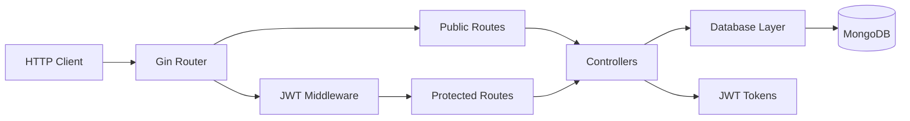

# Ecommerce API

Production-oriented REST API for user authentication, product catalog, shopping cart, checkout, and address management. Built with Go, Gin, MongoDB, and JWT.

---

## Table of Contents

- [Overview](#overview)
- [Features](#features)
- [Architecture](#architecture)
- [Tech Stack](#tech-stack)
- [Prerequisites](#prerequisites)
- [Quick Start](#quick-start)
- [Local Development](#local-development)
- [Configuration](#configuration)
- [API Reference](#api-reference)
- [Authentication](#authentication)
- [Project Structure](#project-structure)
- [Testing & Performance](#testing--performance)
- [Docker](#docker)
- [Security Notes](#security-notes)

---

## Overview

This service exposes a JSON REST API for a typical e-commerce backend. Public endpoints support product browsing and search; authenticated endpoints cover cart operations, checkout, address book management, and product administration.

Data is persisted in MongoDB with two primary collections: `Users` (profiles, carts, orders, addresses) and `Products` (catalog).

---

## Features

| Domain | Capabilities |
|--------|--------------|
| **Authentication** | User signup/login, bcrypt password hashing, JWT access & refresh tokens |
| **Products** | Public listing and name search; authenticated product creation |
| **Cart** | Add/remove items, view cart with total, checkout, instant buy |
| **Addresses** | Add up to two addresses (home/work), edit, delete |
| **Validation** | Request body validation via `go-playground/validator` |
| **Operations** | Docker Compose stack, multi-stage Docker image, HTTP load test harness |

---

## Architecture



**Request flow**

1. Gin receives the HTTP request and applies logging/recovery middleware.
2. Public routes are served without authentication.
3. Protected routes pass through JWT middleware (`Authorization: Bearer <token>` or `token` header).
4. Controllers validate input, call the database layer, and return standardized JSON responses.

---

## Tech Stack

| Layer | Technology |
|-------|------------|
| Language | Go 1.26+ |
| HTTP framework | [Gin](https://github.com/gin-gonic/gin) |
| Database | [MongoDB](https://www.mongodb.com/) 7 |
| Auth | [JWT](https://github.com/golang-jwt/jwt) (HS256) + bcrypt |
| Validation | [go-playground/validator](https://github.com/go-playground/validator) |
| Containerization | Docker, Docker Compose |

---

## Prerequisites

- **Docker & Docker Compose** (recommended), or
- **Go 1.26+** and a running **MongoDB** instance (local or remote)

---

## Quick Start

Start the full stack (API + MongoDB) with Docker Compose:

```bash
docker compose up -d
```

The API listens on **http://localhost:8000**.

Verify connectivity:

```bash
curl http://localhost:8000/users/productview
```

Stop services:

```bash
docker compose down
```

---

## Local Development

### 1. Start MongoDB

Using Docker Compose for MongoDB only:

```bash
docker compose up -d mongo
```

Or point to an existing MongoDB instance via `MONGODB_URI`.

### 2. Set environment variables

```bash
# Linux / macOS
export PORT=8000
export MONGODB_URI=mongodb://localhost:27017
export JWT_SECRET=your-secret-key

# Windows PowerShell
$env:PORT="8000"
$env:MONGODB_URI="mongodb://localhost:27017"
$env:JWT_SECRET="your-secret-key"
```

### 3. Run the API

```bash
go mod download
go run .
```

---

## Configuration

| Variable | Required | Default | Description |
|----------|----------|---------|-------------|
| `PORT` | No | `8000` | HTTP listen port |
| `MONGODB_URI` | No | `mongodb://localhost:27017` | MongoDB connection string |
| `JWT_SECRET` | **Yes** (local) | — | HMAC secret for signing JWTs. Falls back to `SECRET_LOVE` if set. Docker Compose defaults to `dev-jwt-secret`. |

> **Production:** Always set a strong, unique `JWT_SECRET`. Never commit secrets to version control.

---

## API Reference

Base URL: `http://localhost:8000`

### Public Endpoints

| Method | Path | Description |
|--------|------|-------------|
| `POST` | `/users/signup` | Register a new user |
| `POST` | `/users/login` | Authenticate and receive tokens |
| `GET` | `/users/productview` | List all products |
| `GET` | `/users/search?name={query}` | Search products by name |

### Protected Endpoints

Requires a valid JWT. See [Authentication](#authentication).

| Method | Path | Description |
|--------|------|-------------|
| `POST` | `/admin/addproduct` | Add a product to the catalog |
| `POST` | `/addtocart?id={productId}` | Add product to user cart |
| `DELETE` | `/removeitem?id={productId}` | Remove product from cart |
| `GET` | `/usercart` | Get cart items and total |
| `POST` | `/cartcheckout` | Checkout current cart |
| `POST` | `/instantbuy?id={productId}` | Buy a single product immediately |
| `POST` | `/users/addaddress` | Add a delivery address (max 2) |
| `PUT` | `/users/edithomeaddress` | Update home address (index 0) |
| `PUT` | `/users/editworkaddress` | Update work address (index 1) |
| `DELETE` | `/users/deleteaddress` | Remove all saved addresses |

### Request & Response Examples

**Sign up**

```http
POST /users/signup
Content-Type: application/json

{
  "first_name": "Jane",
  "last_name": "Doe",
  "email": "jane@example.com",
  "password": "password123",
  "phone": "9876543210"
}
```

**Login**

```http
POST /users/login
Content-Type: application/json

{
  "email": "jane@example.com",
  "password": "password123"
}
```

Response includes `token`, `refresh_token`, and user profile (password omitted).

**Add product** (authenticated)

```http
POST /admin/addproduct
Authorization: Bearer <token>
Content-Type: application/json

{
  "product_name": "Wireless Headphones",
  "product_description": "Noise-cancelling over-ear headphones",
  "product_price": 149.99,
  "product_image": "https://example.com/headphones.jpg",
  "product_category": "Electronics",
  "product_stock": 50,
  "product_rating": 4.5,
  "product_reviews": []
}
```

### Error Responses

Errors are returned as JSON:

```json
{ "error": "human-readable message" }
```

| Status | Typical cause |
|--------|---------------|
| `400` | Invalid body, validation failure, duplicate email/phone |
| `401` | Missing, invalid, or expired token; wrong credentials |
| `404` | User or product not found |
| `500` | Internal server error |

---

## Authentication

Protected routes accept the JWT in either form:

```http
Authorization: Bearer <access_token>
```

```http
token: <access_token>
```

| Token | Lifetime |
|-------|----------|
| Access token | 24 hours |
| Refresh token | 7 days (168 hours) |

Claims embedded in the access token: `email`, `first_name`, `last_name`, `uid` (user ID).

Obtain tokens via `/users/login` or `/users/signup` (signup returns `201 Created` with a success message; login returns the full user object including tokens).

---

## Project Structure

```
.
├── main.go                 # Entry point, DB connection, router setup
├── routes/                 # Public and protected route definitions
├── controllers/            # HTTP handlers, validation, auth helpers
├── database/               # MongoDB access layer
├── models/                 # Domain models and BSON/JSON tags
├── middleware/             # JWT authentication middleware
├── tokens/                 # JWT generation and validation
├── apiresponse/            # Standardized JSON error/success helpers
├── e2e/
│   ├── api.http            # REST Client manual test suite
│   └── loadtest/           # Concurrent HTTP load test tool
├── Dockerfile              # Multi-stage production image
└── docker-compose.yaml     # MongoDB + API services
```

---

## Testing & Performance

### Manual API testing (`e2e/api.http`)

1. Install the [REST Client](https://marketplace.visualstudio.com/items?itemName=humao.rest-client) extension (VS Code / Cursor).
2. Start the stack: `docker compose up -d`
3. Open `e2e/api.http` and run requests top to bottom.

Variables at the top of the file (`@baseUrl`, `@email`, `@token`, etc.) can be adjusted for repeat runs.

### Load testing (`e2e/loadtest`)

Concurrent HTTP benchmark against live endpoints:

```bash
go run ./e2e/loadtest
```

| Flag | Default | Description |
|------|---------|-------------|
| `-url` | `http://localhost:8000` | API base URL (or `PERF_BASE_URL` env) |
| `-n` | `200` | Requests per scenario |
| `-c` | `20` | Concurrent workers |

The tool bootstraps auth and a test product, then runs scenarios for listing, search, cart, and checkout with latency percentiles.

---

## Docker

### Multi-stage build

The `Dockerfile` produces a minimal Debian-based image:

- **Build stage:** `golang:1.26-bookworm`, static binary (`CGO_ENABLED=0`)
- **Runtime stage:** `debian:bookworm-slim` with CA certificates

### Compose services

| Service | Image | Port | Notes |
|---------|-------|------|-------|
| `mongo` | `mongo:7` | `27017` | Persistent volume `mongo_data`, health check |
| `api` | Built from `Dockerfile` | `8000` | Waits for MongoDB health before starting |

Build and run manually:

```bash
docker build -t ecommerce-api .
docker run -p 8000:8000 \
  -e MONGODB_URI=mongodb://host.docker.internal:27017 \
  -e JWT_SECRET=your-secret \
  ecommerce-api
```

---

## Security Notes

- Passwords are hashed with **bcrypt** before storage; plaintext passwords are never persisted.
- JWTs are signed with **HS256**; protect the signing secret in all environments.
- Login responses omit the password field.
- Input validation is enforced on signup via struct tags (`email`, `min`/`max` length, etc.).
- For production deployments, consider:
  - TLS termination at a reverse proxy or load balancer
  - Role-based access control for `/admin/*` routes
  - Rate limiting and request size limits
  - MongoDB authentication and network isolation
  - Secret management (e.g. Vault, AWS Secrets Manager) instead of plain env vars

---

## License

This project is provided as-is for educational and development purposes. Add a license file if you intend to distribute or open-source the codebase.
