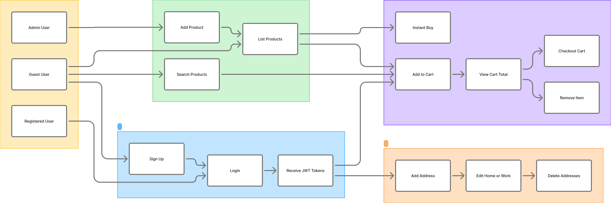
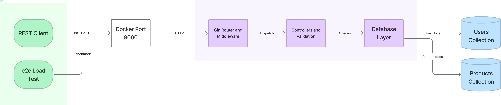

<div align="center">

# 🛒 Ecommerce API

**Production-ready REST backend for auth, catalog, cart, checkout & addresses**

Built with **Go** · **Gin** · **MongoDB** · **JWT**

<br/>

[](https://go.dev/)
[](https://github.com/gin-gonic/gin)
[](https://www.mongodb.com/)
[](https://github.com/golang-jwt/jwt)
[](https://www.docker.com/)

<br/>

[🚀 Quick Start](#-quick-start) ·
[🏗 Architecture](#-architecture) ·
[📡 API Reference](#-api-reference) ·
[🐳 Docker](#-docker) ·
[🔐 Security](#-security)

</div>

---

## 📋 Table of Contents

- [✨ Overview](#-overview)
- [🎯 Features](#-features)
- [🏗 Architecture](#-architecture)
- [🧰 Tech Stack](#-tech-stack)
- [📦 Prerequisites](#-prerequisites)
- [🚀 Quick Start](#-quick-start)
- [💻 Local Development](#-local-development)
- [⚙️ Configuration](#️-configuration)
- [📡 API Reference](#-api-reference)
- [🔑 Authentication](#-authentication)
- [📁 Project Structure](#-project-structure)
- [🧪 Testing & Performance](#-testing--performance)
- [🐳 Docker](#-docker)
- [🔐 Security](#-security)
- [📄 License](#-license)

---

## ✨ Overview

> A high-performance JSON REST API powering a complete e-commerce backend — from guest browsing to authenticated checkout.

| | |
|---|---|
| 🌐 **Public API** | Product listing & search — no login required |
| 🔒 **Protected API** | Cart, checkout & address management (any authenticated user) |
| 👑 **Admin API** | Product creation — requires JWT with `is_admin: true` |
| 🗄 **Persistence** | MongoDB collections: `Users` · `Products` |

---

## 🎯 Features

| Domain | Capabilities |
|:------:|--------------|
| 🔐 **Authentication** | Signup · Login · bcrypt hashing · JWT access & refresh tokens |
| 👑 **Authorization** | Role-based admin access on `/admin/*` · `is_admin` JWT claim |
| 📦 **Products** | Public listing & search · Admin-only product creation |
| 🛍 **Cart** | Add / remove items · View total · Checkout · Instant buy |
| 📍 **Addresses** | Home & work addresses (max 2) · Edit · Delete |
| ✅ **Validation** | Request validation via `go-playground/validator` |
| 🚀 **Operations** | Docker Compose · Multi-stage image · Load test harness |

---

## 🏗 Architecture

### 🎨 Functional Architecture

> Business domains, actors, and how capabilities connect from a user perspective.

<p align="center">
  
</p>

| Domain | 👥 Actors | ⚡ Capabilities |
|--------|-----------|-----------------|
| 🔐 **Authentication** | Guest · Registered User | Sign up · Login · JWT tokens |
| 📦 **Product Catalog** | Guest · User · Admin | Browse · Search · Add products |
| 🛒 **Cart & Checkout** | Registered User | Cart CRUD · Checkout · Instant buy |
| 📍 **Address Management** | Registered User | Add · Edit home/work · Delete |

<details>
<summary><b>🗺 Typical User Journey</b></summary>

<br/>

1. 👀 **Guest** browses or searches the catalog — no auth needed
2. 📝 **User** registers or logs in → receives JWT tokens
3. 🛒 **Authenticated user** adds to cart, manages addresses, checks out
4. 👑 **Admin** adds products → available for all users

</details>

---

### ⚙️ Technical Architecture

> System components, deployment entry point, and data persistence.

<p align="center">
  
</p>

| Layer | 🧩 Components | 📌 Responsibility |
|-------|---------------|-------------------|
| 💻 **Clients** | REST Client · e2e load test | HTTP/JSON requests |
| 🚪 **Entry Point** | Docker Compose `:8000` | Exposes API to host |
| 🐹 **Go Application** | Gin · JWT + Admin middleware · Controllers · DB layer | Routing · Auth · RBAC · Business logic |
| 🍃 **MongoDB 7** | `Users` · `Products` | Profiles · Carts · Orders · Catalog |

<details>
<summary><b>🔄 Request Flow</b></summary>

<br/>

```
Client  →  Gin Router  →  Middleware  →  Controller  →  Database  →  MongoDB
                │              │
                │         JWT Auth (protected routes)
                │         AdminOnly (/admin/* only)
                └── Logger + Recovery
```

1. Gin receives the request with logging & recovery middleware
2. 🟢 **Public routes** — no authentication
3. 🔒 **Protected routes** — JWT via `Authorization: Bearer <token>` or `token` header
4. 👑 **Admin routes** — JWT plus `is_admin: true` claim (403 otherwise)
5. Controllers validate input → database layer → JSON response

</details>

---

## 🧰 Tech Stack

<div align="center">

| Layer | Technology |
|:-----:|:-----------|
| 🐹 **Language** | Go 1.26+ |
| ⚡ **HTTP** | [Gin](https://github.com/gin-gonic/gin) |
| 🍃 **Database** | [MongoDB](https://www.mongodb.com/) 7 |
| 🔑 **Auth** | [JWT](https://github.com/golang-jwt/jwt) HS256 + bcrypt |
| ✅ **Validation** | [go-playground/validator](https://github.com/go-playground/validator) |
| 🐳 **Containers** | Docker · Docker Compose |

</div>

---

## 📦 Prerequisites

| Option | Requirements |
|:------:|:-------------|
| 🐳 **Recommended** | Docker & Docker Compose |
| 💻 **Local** | Go 1.26+ · MongoDB instance |

---

## 🚀 Quick Start

```bash
# 🐳 Start API + MongoDB
docker compose up -d
```

✅ API available at **http://localhost:8000**

```bash
# 🔍 Verify
curl http://localhost:8000/users/productview
```

```bash
# 🛑 Stop
docker compose down
```

---

## 💻 Local Development

### 1️⃣ Start MongoDB

```bash
docker compose up -d mongo
```

Or set `MONGODB_URI` to your existing instance.

### 2️⃣ Environment Variables

```bash
# 🐧 Linux / macOS
export PORT=8000
export MONGODB_URI=mongodb://localhost:27017
export JWT_SECRET=your-secret-key
export ADMIN_EMAILS=you@example.com
```

```powershell
# 🪟 Windows PowerShell
$env:PORT="8000"
$env:MONGODB_URI="mongodb://localhost:27017"
$env:JWT_SECRET="your-secret-key"
$env:ADMIN_EMAILS="you@example.com"
```

### 3️⃣ Run the API

```bash
go mod download
go run .
```

---

## ⚙️ Configuration

| Variable | Required | Default | Description |
|----------|:--------:|:-------:|-------------|
| `PORT` | ❌ | `8000` | HTTP listen port |
| `MONGODB_URI` | ❌ | `mongodb://localhost:27017` | MongoDB connection string |
| `JWT_SECRET` | ✅ | — | HMAC secret for JWT signing |
| `ADMIN_EMAILS` | ❌ | — | Comma-separated emails granted admin on signup/login (Docker Compose sets defaults for e2e) |

> ⚠️ **Production:** Use a strong, unique `JWT_SECRET`. Never commit secrets to version control. Set `ADMIN_EMAILS` explicitly for admin accounts — clients cannot self-promote via signup JSON.

---

## 📡 API Reference

**Base URL:** `http://localhost:8000`

### 🟢 Public Endpoints

| Method | Path | Description |
|:------:|------|-------------|
| `POST` | `/users/signup` | 📝 Register a new user |
| `POST` | `/users/login` | 🔑 Authenticate & receive tokens |
| `GET` | `/users/productview` | 📦 List all products |
| `GET` | `/users/search?name={query}` | 🔍 Search products by name |

### 🔒 Protected Endpoints

> Requires valid JWT — see [Authentication](#-authentication)

| Method | Path | Description |
|:------:|------|-------------|
| `POST` | `/addtocart?id={productId}` | 🛒 Add to cart |
| `DELETE` | `/removeitem?id={productId}` | ❌ Remove from cart |
| `GET` | `/usercart` | 👀 View cart & total |
| `POST` | `/cartcheckout` | 💳 Checkout cart |
| `POST` | `/instantbuy?id={productId}` | ⚡ Instant buy |
| `POST` | `/users/addaddress` | 📍 Add address (max 2) |
| `PUT` | `/users/edithomeaddress` | 🏠 Edit home address |
| `PUT` | `/users/editworkaddress` | 🏢 Edit work address |
| `DELETE` | `/users/deleteaddress` | 🗑 Delete all addresses |

### 👑 Admin Endpoints

> Requires valid JWT **and** `is_admin: true` — see [Authentication](#-authentication)

| Method | Path | Description |
|:------:|------|-------------|
| `POST` | `/admin/addproduct` | ➕ Add product to catalog |

<details>
<summary><b>📝 Request & Response Examples</b></summary>

<br/>

**Sign up**

```http
POST /users/signup
Content-Type: application/json

{
  "first_name": "Jane",
  "last_name": "Doe",
  "email": "jane@example.com",
  "password": "password123",
  "phone": "9876543210"
}
```

**Login**

```http
POST /users/login
Content-Type: application/json

{
  "email": "jane@example.com",
  "password": "password123"
}
```

Response includes `token`, `refresh_token`, `is_admin`, and user profile (password omitted).

**Add product** *(admin only)*

```http
POST /admin/addproduct
Authorization: Bearer <admin-token>
Content-Type: application/json

{
  "product_name": "Wireless Headphones",
  "product_description": "Noise-cancelling over-ear headphones",
  "product_price": 149.99,
  "product_image": "https://example.com/headphones.jpg",
  "product_category": "Electronics",
  "product_stock": 50,
  "product_rating": 4.5,
  "product_reviews": []
}
```

</details>

### ❌ Error Responses

```json
{ "error": "human-readable message" }
```

| Status | Meaning |
|:------:|---------|
| `400` | 🟡 Bad request · validation · duplicate email/phone |
| `401` | 🔴 Unauthorized · missing/invalid/expired token |
| `403` | 🟠 Forbidden · authenticated but not admin (admin routes) |
| `404` | ⚫ Not found · user or product missing |
| `500` | 🔴 Internal server error |

---

## 🔑 Authentication

Protected routes accept JWT in either form:

```http
Authorization: Bearer <access_token>
```

```http
token: <access_token>
```

| Token | ⏱ Lifetime |
|-------|-----------|
| 🎫 Access token | 24 hours |
| 🔄 Refresh token | 7 days |

**Claims:** `email` · `first_name` · `last_name` · `uid` · `is_admin`

Obtain tokens via `/users/login` or `/users/signup`.

### 👑 Admin access

Admin status is stored on the user document (`is_admin`) and embedded in the JWT at token issuance.

| How admins are assigned | Behavior |
|-------------------------|----------|
| **`ADMIN_EMAILS` env** | Comma-separated list; matching emails get `is_admin: true` on signup or next login |
| **Existing admins** | `is_admin` persists in MongoDB; re-login refreshes the JWT claim |

Non-admin users receive **403 Forbidden** on `/admin/*` routes even with a valid JWT.

**Docker Compose defaults** (for e2e / load tests): `e2e-http@example.com`, `loadtest-admin@example.com`

---

## 📁 Project Structure

```
📦 ecommerce-go
├── 📄 main.go                 # Entry point · DB · router
├── 🛣 routes/                 # Public & protected routes
├── 🎮 controllers/            # HTTP handlers · validation · admin bootstrap
├── 🗄 database/               # MongoDB access layer
├── 📐 models/                 # Domain models
├── 🛡 middleware/             # JWT authentication · AdminOnly RBAC
├── 🔑 tokens/                 # JWT generation & validation
├── 📤 apiresponse/            # Standardized JSON responses
├── 📚 docs/
│   └── 🏗 architecture/       # Architecture diagram PNGs
├── 🧪 e2e/
│   ├── api.http               # REST Client test suite
│   └── loadtest/              # Concurrent load test tool
├── 🐳 Dockerfile              # Multi-stage production image
└── 🐳 docker-compose.yaml     # MongoDB + API services
```

---

## 🧪 Testing & Performance

### 🖱 Manual Testing — `e2e/api.http`

1. Install [REST Client](https://marketplace.visualstudio.com/items?itemName=humao.rest-client) extension
2. `docker compose up -d` (includes default `ADMIN_EMAILS` so `e2e-http@example.com` can add products)
3. Open `e2e/api.http` → run requests top to bottom

### ⚡ Load Testing — `e2e/loadtest`

```bash
go run ./e2e/loadtest
```

| Flag | Default | Description |
|------|:-------:|-------------|
| `-url` | `http://localhost:8000` | API base URL |
| `-n` | `200` | Requests per scenario |
| `-c` | `20` | Concurrent workers |

Uses the `loadtest-admin@example.com` admin account (included in Docker Compose `ADMIN_EMAILS`), bootstraps a test product, then benchmarks listing, search, cart & checkout with latency percentiles.

---

## 🐳 Docker

### 🏗 Multi-stage Build

| Stage | Image | Output |
|-------|-------|--------|
| 🔨 Build | `golang:1.26-bookworm` | Static binary (`CGO_ENABLED=0`) |
| 🚀 Runtime | `debian:bookworm-slim` | Minimal image + CA certs |

### 📦 Compose Services

| Service | Image | Port | Notes |
|:-------:|-------|:----:|-------|
| 🍃 `mongo` | `mongo:7` | `27017` | Persistent volume · health check |
| 🐹 `api` | Built from `Dockerfile` | `8000` | Waits for MongoDB health · sets default `ADMIN_EMAILS` for e2e |

```bash
docker build -t ecommerce-api .
docker run -p 8000:8000 \
  -e MONGODB_URI=mongodb://host.docker.internal:27017 \
  -e JWT_SECRET=your-secret \
  -e ADMIN_EMAILS=admin@example.com \
  ecommerce-api
```

---

## 🔐 Security

| | |
|---|---|
| 🔒 **Passwords** | bcrypt hashed — never stored in plaintext |
| 🎫 **JWT** | HS256 signed — protect `JWT_SECRET` in all environments |
| 👑 **Admin RBAC** | `/admin/*` requires `is_admin` JWT claim — assigned via `ADMIN_EMAILS` or stored flag |
| 🚫 **Responses** | Password field omitted from login responses |
| ✅ **Validation** | Struct tags on signup (`email`, length constraints) |

<details>
<summary><b>🏭 Production Checklist</b></summary>

<br/>

- [ ] TLS termination at reverse proxy / load balancer
- [x] Role-based access control for `/admin/*` routes
- [ ] Rate limiting & request size limits
- [ ] MongoDB authentication & network isolation
- [ ] Secret management (Vault, AWS Secrets Manager, etc.)

</details>

---

## 📄 License

This project is provided as-is for educational and development purposes.

---

<div align="center">

**Built with ❤️ using Go**

⭐ Star this repo if you find it useful!

</div>
